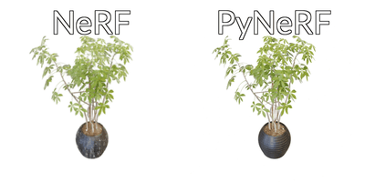

# PyNeRF: Pyramidal Neural Radiance Fields

This is the official implementation of [PyNeRF](https://haithemturki.com/pynerf/).



# Installation

## 1. Install NerfStudio+PyNeRF

Installing PyNeRF should include Nerfstudio as a dependency (tested on v3.4.0)

```bash
pip install git+https://github.com/hturki/pynerf
```

Alternatively, clone then install this repo:
```bash
git clone https://github.com/hturki/pynerf.git
cd pynerf
pip install -e .
```

## 2. Install additional dependences

```bash
pip install git+https://github.com/NVlabs/tiny-cuda-nn/#subdirectory=bindings/torch
pip install torch-scatter -f https://data.pyg.org/whl/torch-2.1.0+${CUDA}.html
```


The following command should now include `pynerf` as one of the options:
```bash
ns-train -h
```

# Data Preparation

## Multicam

1. Download the [NeRF Synthetic dataset](https://www.matthewtancik.com/nerf)
2. Run the conversion script in the [mip-NeRF repository](https://github.com/google/mipnerf/blob/main/scripts/convert_blender_data.py)
3. Use Multicam dataparser

## Blender-A

1. Download the [Blender-A](https://drive.google.com/file/d/1y4F4tuAs4WT3d2cO1gD0NeAcgKv0Ip_7/view?usp=sharing) scenes
2. Use Multicam dataparser

## Mip-NeRF 360

1. Download the data from the [Mip-NeRF 360 project page](https://jonbarron.info/mipnerf360/)
2. Use MipNeRF 360 dataparser

## ADOP

1. Download the scenes and model checkpoints from the links in the [ADOP Github repo](https://github.com/darglein/ADOP)
2. Run ``scripts/process_adop.py`` 
3. Use the ADOP dataparser

# Citation

```
@InProceedings{turki2023pynerf,
    title = {PyNeRF: Pyramidal Neural Radiance Fields},
    author = {Haithem Turki and Michael Zollh\"{o}fer and Christian Richardt and Deva Ramanan},
    booktitle={Thirty-Seventh Conference on Neural Information Processing Systems},
    year = {2023}
}
```
